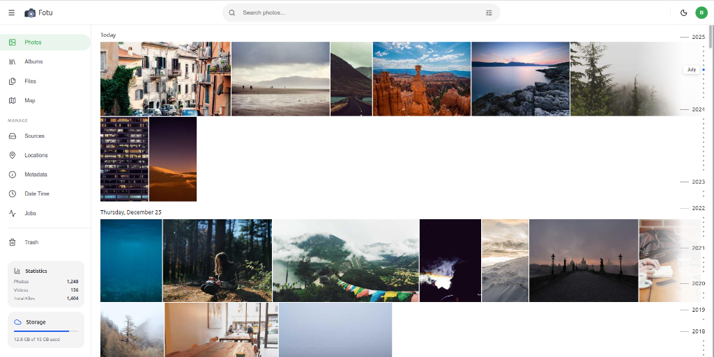

# Fotu 📸



Fotu is a modern, high-performance photo management application designed to organize, scan, and view your media library with ease.

## ✨ Features

- **Media Gallery**: A responsive and fluid gallery interface for viewing photos and videos.
- **Job Management**: Robust background processing for directory scanning and media indexing.
- **Real-time Progress**: Live updates on background jobs using BullMQ and a clean monitoring UI.
- **Concurrency Control**: Intelligent handling of multiple processing tasks.
- **Map Integration**: View your media's metadata and locations on an interactive map.

## 🛠️ Tech Stack

### Frontend
- **Framework**: React 19 + Vite
- **Language**: TypeScript
- **State/Routing**: React Router 7
- **Styling**: Vanilla CSS with modern aesthetics
- **Components**: Lucide Icons, Leaflet (Maps), React Virtuoso (Lists)

### Backend
- **Runtime**: Node.js + Express
- **Language**: TypeScript
- **Database**: PostgreSQL (via Prisma ORM)
- **Queue/Cache**: Redis + BullMQ
- **Documentation**: Swagger/OpenAPI

## 🚀 Getting Started

### Prerequisites
- Node.js (v18+)
- pnpm
- Docker & Docker Compose

### Installation

1. Clone the repository:
   ```bash
   git clone git@github.com:brhn-me/fotu.git
   cd fotu
   ```

2. Install dependencies:
   ```bash
   pnpm install
   ```

3. Start infrastructure (Postgres & Redis):
   ```bash
   docker-compose up -d
   ```

4. Set up the database:
   ```bash
   cd backend
   pnpm prisma:migrate
   ```

### Running the App

Run both frontend and backend concurrently from the root:
```bash
pnpm dev
```

- **Frontend**: [http://localhost:5173](http://localhost:5173)
- **Backend API**: [http://localhost:3000](http://localhost:3000)

## 📁 Project Structure

```text
fotu/
├── backend/          # Express API & Prisma Schema
├── frontend/         # React application
├── docker-compose.yml # Infrastructure setup
└── package.json      # Workspace configuration
```

## 📜 Scripts

| Command | Description |
| :--- | :--- |
| `pnpm dev` | Starts frontend and backend in development mode |
| `pnpm build` | Builds both frontend and backend for production |
| `pnpm test` | Runs tests across the workspace |
| `pnpm dev:frontend` | Starts only the frontend |
| `pnpm dev:backend` | Starts only the backend |

---
Made with ❤️ for photo enthusiasts.
